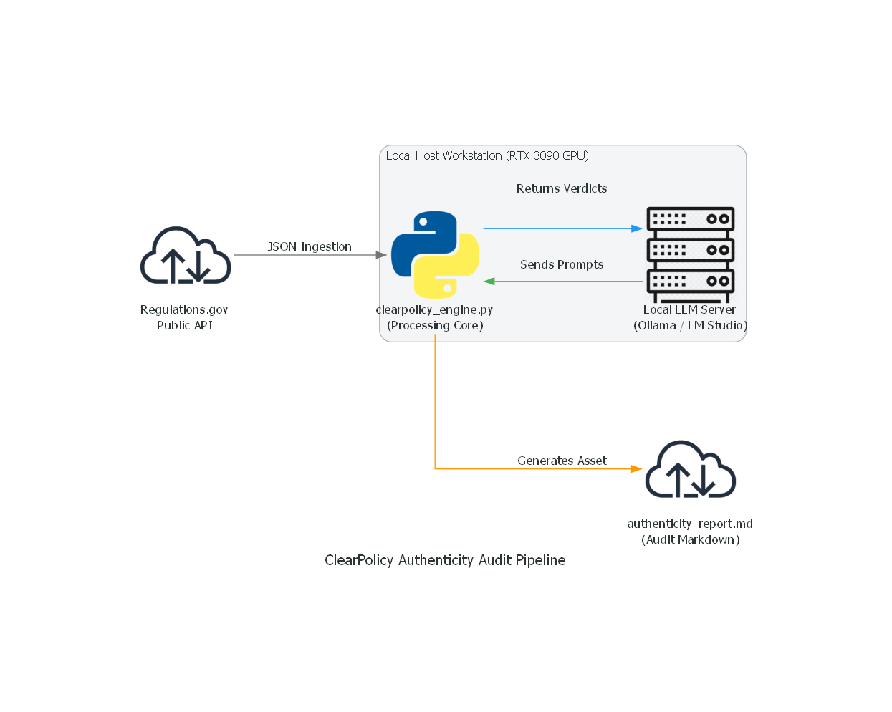

# ClearPolicy Engine: Authenticity Audit Prototype

A functional backend prototype developed for the **ClearPolicy S26 Internship Pitch (Team Andromeda)**.

### The Problem

When government agencies open public policy for comment, the portals are frequently flooded by astroturfed bot campaigns and repetitive corporate templates. This drowns out authentic citizen voices, making civic participation feel useless.

### The Solution

This prototype serves as an "AI Bouncer" for government data. It proves that ClearPolicy can use locally hosted Large Language Models to instantly audit public dockets, filtering out coordinated bot spam to highlight genuine human feedback.

### System Architecture

1. **Data Ingestion:** The script bypasses clunky government UX by establishing a secure, direct connection to the `Regulations.gov` API, pulling live federal dockets.
2. **Local AI Auditing:** Instead of relying on passive, generic chatbots, the engine feeds the raw comment text into a local LLM via a local GPU setup. The model is specifically prompted to detect bot-like corporate syntax versus authentic human anecdotes.
3. **Data Formatting:** The audited data is stripped of legalese and exported into a clean, highly readable `authenticity_report.md` file.


### How to Get Your Regulations.gov API Key

To run this script, you must authenticate with the official US Government Data API.

1. Go to the official Data.gov signup page: [https://api.data.gov/signup/](https://api.data.gov/signup/)
2. Fill out the required fields: First Name, Last Name, and a valid Email address.
3. Submit the form. Your unique 40-character API key will be displayed on the screen and a copy will be emailed to you.

### How to Run Locally

Ensure you have your virtual environment set up and a local LLM server (like LM Studio or Ollama) running on port `8080`.

1. Install dependencies:
   ```bash
   pip install requests openai
   ```
